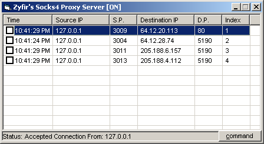



## Socks4 Proxy Server

### Description

Updated. This is a working SOCKS4 Proxy Server..

Allow Multi Connection and can kill selected connection on request. Easy to understand programming code. Comments Added.
 
### More Info
 
Port Number is 1080..

Is Changable in the Load Function (in the menu)..

Slows down the computer a bit?

             |
---                |---
**Submitted On**   |2003-04-17 23:00:36
**By**             |[Tyler](https://github.com/Planet-Source-Code/PSCIndex/blob/master/ByAuthor/tyler.md)
**Level**          |Intermediate
**User Rating**    |5.0 (65 globes from 13 users)
**Compatibility**  |VB 6\.0
**Category**       |[Internet/ HTML](https://github.com/Planet-Source-Code/PSCIndex/blob/master/ByCategory/internet-html__1-34.md)
**World**          |[Visual Basic](https://github.com/Planet-Source-Code/PSCIndex/blob/master/ByWorld/visual-basic.md)
**Archive File**   |[Socks4\_Pro1575434182003\.zip](https://github.com/Planet-Source-Code/tyler-socks4-proxy-server__1-44815/archive/master.zip)

